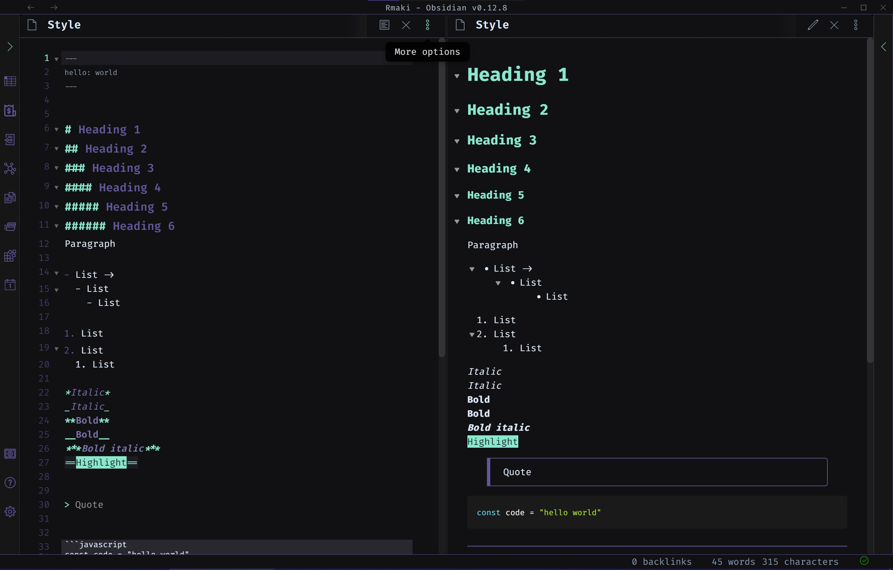

# RMAKI OBSIDIAN

> Dark theme for [Obsidian](https://obsidian.md/)



Tested with Obsidian Desktop v.0.13.0 and Obsidian Mobile (Android) v.1.0.5

Uses [Fira Code](https://fonts.google.com/specimen/Fira+Code).

This theme is a work in progress. Please feel free to raise an issue for any bugs or suggestions.

Twitter: [luke-rmaki](https://twitter.com/luke_rmaki)

<br />

---

## To Do

- [x] Search result hover colors
- [x] Tag pane nested hover style bug
- [x] Linked mention nested hover
- [ ] Linked mention icon active
- [x] Outline hover
- [x] Editor popups
- [ ] Graph view
- [x] Mobile active folder style

## How to install
### Option 1 (Add from Obsidian)
- This theme is now listed in Obsidian's community themes
- Open Obsidian -> Settings -> Appearance 
- Browser Community themes and search for Rmaki


### Option 2 (Download):

1. Download the `Rmaki-Obsidian.css` file
2. Copy into your themes folder
3. Open Settings -> Appearances
4. Change Theme to 'Rmaki-Obsidian'

### Option 3 (Build):

1. Clone the repo
2. Navigate to folder
3. Install deps

```bash
yarn install
```

or

```bash
npm install
```

4. Create a .env file with a single variable called DEST which points to the themes folder in your vault
5. Run build

```bash
yarn build
```

or

```bash
npm run build
```
